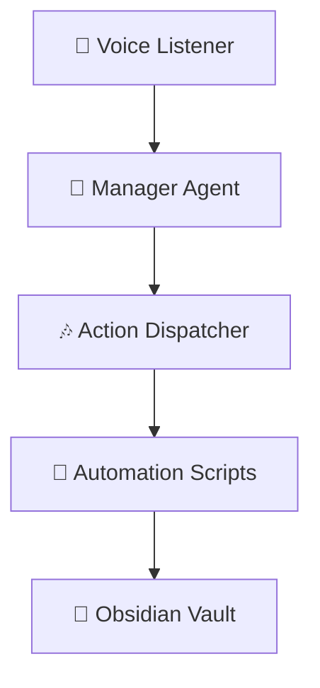

# 🎻 Command Orchestra 🪄

Welcome to your **AI Agent Automation Playground**!

## 🚀 Vision

Build your own living operating system: command your AI Agent with your voice (or text), and watch it orchestrate workflows, open apps, and automate your creative rituals. Speech-2-Action! 🗣️✨

## 🪄 Spells (Commands)

| Spell                        | What it Does                                                                                                    |
| ---------------------------- | --------------------------------------------------------------------------------------------------------------- |
| `spell book` / `list spells` | Shows all available spells and their descriptions                                                               |
| `new gym` / `muscle up`      | Create a new gym obsidian directory for today in your exercise vault, cycling exercise groups and copying previous notes |
| `new day`                    | Create today's daily note in your main Obsidian vault, using the daily template if available                    |
| `new day two`                | Create tomorrow's daily note in your main Obsidian vault, using the daily template if available                 |

**Daily notes are created at:**

```
<OBSIDIAN_MAIN_VAULT_PATH>/📆/<year-month>/<year-month-day>.md
```

**Template location:**

```
<OBSIDIAN_MAIN_VAULT_PATH>/Templates/Daily Note Template.md
```

---

## 🏗️ Architecture



- **Modular**: Add new actions easily
- **Configurable**: All settings via `.env` and Pydantic
- **Extensible**: Plug in new voice models, scripts, or automations
- **AI-Powered**: LLM-based command understanding

## 📦 Project Structure

```text
Command-Orchestra/
├── .venv/
├── requirements.txt
├── README.md
└── speech2action/
    ├── main.py
    │   ├── manager_agent.py  # OpenAI Agents implementation
    │   ├── obsidian_automation.py
    │   └── spell_book.py     # Spell definitions
    ├── config/
    └── core/
```

## 🛠️ Setup

1. **Clone repo & create venv:**
   ```bash
   git clone <repo-url>
   cd Command-Orchestra
   python3 -m venv .venv
   source .venv/bin/activate
   ```
2. **Install requirements:**
   ```bash
   pip install --upgrade pip
   pip install -r requirements.txt
   ```
3. **Configure your Obsidian vault path in `.env`:**
   ```env
   OBSIDIAN_MAIN_VAULT_PATH=/absolute/path/to/your/main/vault
   OBSIDIAN_EXERCISE_VAULT_PATH=/absolute/path/to/your/exercise/vault
   OPENAI_API_KEY=your_openai_api_key  # Required for Agent mode
   ```
4. **Run the app from root:**
   ```bash
   python -m speech2action.main
   ```
   > Play, experiment, and extend — your digital symphony awaits! 🎶
