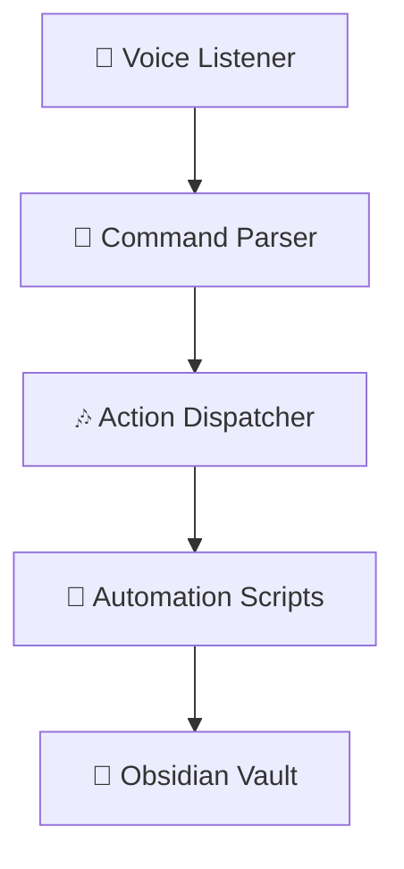

# 🎻 Command Orchestra 🪄

Welcome to your **Speech-2-Action Playground**! 🗣️✨

## 🚀 Vision

Build your own living operating system: command your machine with your voice (or text), and watch it orchestrate workflows, open apps, and automate your creative rituals. First up: Obsidian vault automation!

## 🏗️ Architecture



- **Modular**: Add new actions easily
- **Configurable**: All settings via `.env` and Pydantic
- **Extensible**: Plug in new voice models, scripts, or automations

## 📦 Project Structure

```text
Command-Orchestra/
├── .venv/
├── requirements.txt
├── README.md
└── speech2action/
    ├── main.py
    ├── actions/
    ├── config/
    └── core/
```

## 🛠️ Setup

1. **Clone repo & create venv:**
   ```bash
   git clone <repo-url>
   cd Command-Orchestra
   python3 -m venv .venv
   source .venv/bin/activate
   ```
2. **Install requirements:**
   ```bash
   pip install --upgrade pip
   pip install -r requirements.txt
   ```
3. **Configure your Obsidian vault path in `.env`:**
   ```env
   OBSIDIAN_EXERCISE_VAULT_PATH=/absolute/path/to/your/vault
   ```
4. **Run the app from root:**
   ```bash
   python -m speech2action.main
   ```

## 🧪 First Spell: "new gym"

Type `new gym` — the system will create a new gym directory in your Obsidian vault for today, cycling through your exercise groups and copying previous notes!

---

- Run the app as a module from root: `python -m speech2action.main`

> Play, experiment, and extend — your digital symphony awaits! 🎶
